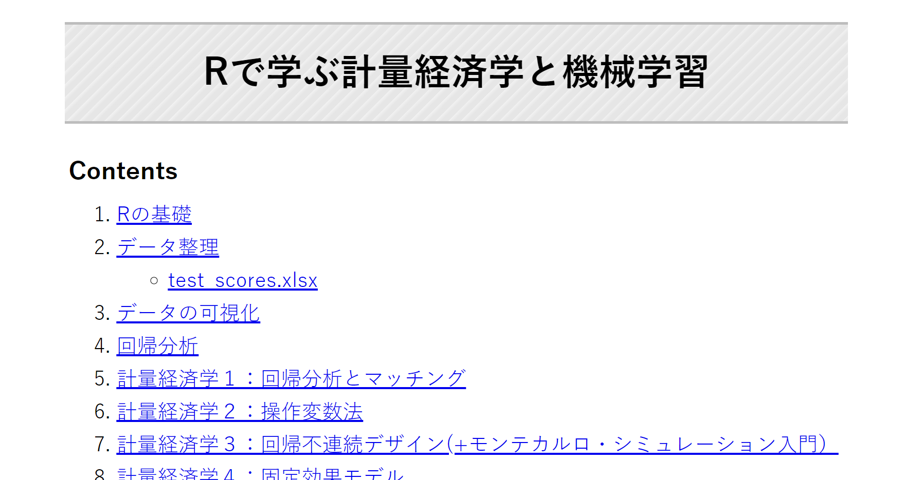

# Contributions

### OSS

- [microsoft/LightGBM](https://github.com/microsoft/LightGBM)
- [dmlc/xgboost](https://github.com/dmlc/xgboost)
- [stan-dev/pystan](https://github.com/stan-dev/pystan)
- [Georgy Meshcheryakov/semopy](https://gitlab.com/georgy.m/semopy/-/tree/dev)

### Others

- [michihito-ando/econome_ml_with_R](https://github.com/michihito-ando/econome_ml_with_R)

# 作ったもの

自分用に作った、ちょっとしたアプリ等をPublicリポジトリにしています。

## Chrome Extensions

### [link-generator](https://github.com/nigimitama/link-generator)

- 開いているページへのリンクを任意のフォーマット（markdown, html等）で生成するChrome拡張
- [Link Generator - Chrome Web Store](https://chrome.google.com/webstore/detail/link-generator/dcepleilgmacpdjlcbgjaddnoejognkc)

### [note-toc](https://github.com/nigimitama/note-toc)

- note.comにて記事の目次を右端に固定表示するChrome拡張
- [note toc - Chrome ウェブストア](https://chrome.google.com/webstore/detail/note-toc/dddpojfjpcidbebhjijlchdkfmegoidg?hl=ja)

### [Book Searcher](https://github.com/nigimitama/book-searcher)

- 書籍情報を検索するためのChrome拡張
- [Book Searcher - Chrome ウェブストア](https://chromewebstore.google.com/detail/book-searcher/phkdhohknijcjmbpdcginagjiahakcee)

## Desktop Apps

### [image-editor-for-ebook](https://github.com/nigimitama/image-editor-for-ebook)

電子書籍の自作のためのシンプルな画像処理を行うGUIアプリ

### [searchable-pdf-maker](https://github.com/nigimitama/searchable-pdf-maker)

電子書籍の自作のためのpdf変換器。
複数の画像を1つのPDFにまとめ、その際にOCRをかけて検索可能なPDFにする。

### [Dimmer](https://github.com/nigimitama/dimmer)

PCに接続された全てのディスプレイの輝度を一元管理するアプリ。

朝になったら自動的に明るく、夜になったら自動的に暗くなるようにスケジューリングしたりできる。

## Others

### [michihito-ando/econome_ml_with_R](https://github.com/michihito-ando/econome_ml_with_R)（共同執筆）

- 計量経済学と機械学習をRで動かしながら学ぶ教材

### [ksj](https://github.com/nigimitama/ksj)

国土数値情報ダウンロードサービスのAPIを簡単に使えるようにするpythonパッケージ

（※APIのサービス終了につき現在は使用できません）

## Web App

- [tiny-tools](https://github.com/nigimitama/tiny-tools)：画像のbase64エンコーディングやURLの短縮など、ちょっとした便利ツールをまとめたもの
