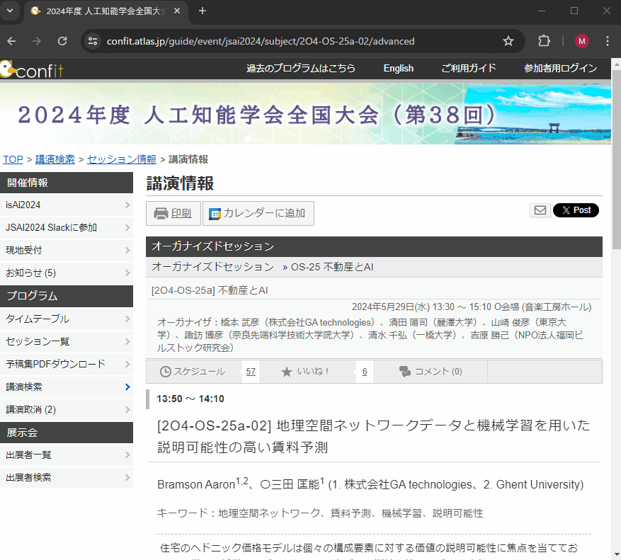

[](https://github.com/anuraghazra/github-readme-stats)

# Contributions

### OSS

- [microsoft/LightGBM](https://github.com/microsoft/LightGBM)
- [dmlc/xgboost](https://github.com/dmlc/xgboost)
- [stan-dev/pystan](https://github.com/stan-dev/pystan)
- [Georgy Meshcheryakov/semopy](https://gitlab.com/georgy.m/semopy/-/tree/dev)

### Others

- [michihito-ando/econome_ml_with_R](https://github.com/michihito-ando/econome_ml_with_R)

# 作ったもの

自分用に作った、ちょっとしたアプリ等を Public リポジトリにしています。

## Chrome Extensions

### [link-generator](https://github.com/nigimitama/link-generator)

- 開いているページへのリンクを任意のフォーマット（markdown, html 等）で生成する Chrome 拡張
- [Link Generator - Chrome Web Store](https://chrome.google.com/webstore/detail/link-generator/dcepleilgmacpdjlcbgjaddnoejognkc)

<a href="https://chrome.google.com/webstore/detail/link-generator/dcepleilgmacpdjlcbgjaddnoejognkc">
  
</a>

### [Tab Image Downloader](https://github.com/nigimitama/tab-image-downloader)

- タブで開いている画像たちを一括ダウンロードする拡張機能
- [Download Image in Tabs - Chrome ウェブストア](https://chromewebstore.google.com/detail/download-image-in-tabs/lgihlkigabibkibnobiigjnpibepoljo)

<a href="https://chromewebstore.google.com/detail/download-image-in-tabs/lgihlkigabibkibnobiigjnpibepoljo">
  
</a>

### [note-toc](https://github.com/nigimitama/note-toc)

- note.com にて記事の目次を右端に固定表示する Chrome 拡張
- [note toc - Chrome ウェブストア](https://chrome.google.com/webstore/detail/note-toc/dddpojfjpcidbebhjijlchdkfmegoidg?hl=ja)

<a href="https://chrome.google.com/webstore/detail/note-toc/dddpojfjpcidbebhjijlchdkfmegoidg?hl=ja">
  
</a>

### [Book Searcher](https://github.com/nigimitama/book-searcher)

- 書籍情報を検索するための Chrome 拡張
- [Book Searcher - Chrome ウェブストア](https://chromewebstore.google.com/detail/book-searcher/phkdhohknijcjmbpdcginagjiahakcee)

<a href="https://chromewebstore.google.com/detail/book-searcher/phkdhohknijcjmbpdcginagjiahakcee">
  
</a>

### [Confit to Calendar](https://github.com/nigimitama/confit-to-calendar)

- Confit（学会イベント情報サイト）に「カレンダーに追加」というボタンを追加し、Google カレンダーへと予定を追加しやすくする Chrome 拡張機能
- [Chrome ウェブストア](https://chromewebstore.google.com/detail/confit-to-calendar/dinagahlibbjlffmalfopaihhgbciojo)

<a href="https://github.com/nigimitama/confit-to-calendar">
  
</a>

## Desktop Apps

### [image-editor-for-ebook](https://github.com/nigimitama/image-editor-for-ebook)

電子書籍の自作のためのシンプルな画像処理を行う GUI アプリ

<a href="https://github.com/nigimitama/image-editor-for-ebook">
  
</a>

### [searchable-pdf-maker](https://github.com/nigimitama/searchable-pdf-maker)

電子書籍の自作のための pdf 変換器。
複数の画像を 1 つの PDF にまとめ、その際に OCR をかけて検索可能な PDF にする。

<a href="https://github.com/nigimitama/searchable-pdf-maker">
  
</a>

### [Dimmer](https://github.com/nigimitama/dimmer)

PC に接続された全てのディスプレイの輝度を一元管理するアプリ。

朝になったら自動的に明るく、夜になったら自動的に暗くなるようにスケジューリングしたりできる。

<a href="https://github.com/nigimitama/dimmer">
  
</a>

## Web App

### [tiny-tools.net](https://tiny-tools.net/)


- 画像の base64 エンコーディングや URL の短縮など、ちょっとした便利ツールをまとめたサイト

## Python パッケージ

### [ordinalcorr](https://github.com/nigimitama/ordinalcorr)

順序尺度の変数に対する相関係数を実装した Python パッケージ。

- Repository: [nigimitama/ordinalcorr: A Python package for calculating correlation coefficients for ordinal variables.](https://github.com/nigimitama/ordinalcorr)
- PyPI: [ordinalcorr · PyPI](https://pypi.org/project/ordinalcorr/)

```python
>>> from ordinalcorr import polychoric
>>> x = [1, 1, 2, 2, 3, 3]
>>> y = [0, 0, 0, 1, 1, 1]
>>> polychoric(x, y)
0.9986287922435596
```

### [ksj](https://github.com/nigimitama/ksj)

国土数値情報ダウンロードサービスの API を簡単に使えるようにする python パッケージ

（※API のサービス終了につき現在は使用できません）

<a href="https://github.com/nigimitama/ksj">
  
</a>

## Others

### [michihito-ando/econome_ml_with_R](https://github.com/michihito-ando/econome_ml_with_R)（共同執筆）

- 計量経済学と機械学習を R で動かしながら学ぶ教材。
- 立教大学の「データサイエンス概論」という講義を中心に教育現場で利用されています。

<a href="https://michihito-ando.github.io/econome_ml_with_R/">
  
</a>
